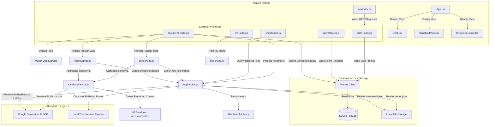

# RDA: Project Directory & File Structure Explanation

This document provides a comprehensive explanation of the file structure, folder hierarchies, and connection paths for the **RAG Document Assistant (RDA)** final year project. It maps files to their specific roles and explains how the frontend and backend are interconnected.

---

## 📂 Overall Folder Architecture

The project is structured into a monorepo containing two main parts:
1. **`RDA-frontend/`**: The client-side application built using Vite, React, TypeScript, and Tailwind CSS.
2. **`backend/`**: The server-side API built using Node.js, Express, Prisma ORM, and SQLite.

```
RAG-Document-Assistant/
├── RDA-frontend/          # React + Vite + TypeScript Frontend
│   ├── public/            # Static assets
│   ├── src/               # React source files
│   │   ├── api/           # API integration client (Axios)
│   │   ├── components/    # Reusable UI pages and widgets
│   │   ├── types/         # TypeScript definitions
│   │   └── App.tsx        # React main workspace router
│   ├── package.json       # Frontend dependencies and scripts
│   └── vite.config.ts     # Vite build settings
│
├── backend/               # Node.js + Express Backend API
│   ├── prisma/            # SQLite Database schema and migrations
│   │   ├── schema.prisma  # Prisma database schema definition
│   │   └── dev.db         # Local SQLite database file
│   ├── src/               # Node.js source files
│   │   ├── config/        # Environment configurations
│   │   ├── middleware/    # Auth, security, and error handlers
│   │   ├── routes/        # Express API endpoints
│   │   ├── services/      # Business logic (RAG, Sandbox, ML)
│   │   └── app.js         # Express main entry point
│   ├── uploads/           # Physical directory for files & search indices
│   ├── package.json       # Backend dependencies and scripts
│   └── nodemon.json       # Nodemon daemon settings
│
└── package.json           # Root package.json for orchestrating
```

---

## 🎨 1. Frontend: `RDA-frontend/`

The frontend uses a modern React architecture structured around a single-page workspace layout.

### Key Directories and Files in `RDA-frontend/src/`

| Path | Purpose / Functionality | Technologies Used |
| :--- | :--- | :--- |
| `App.tsx` | **Main Workspace Router**: Orchestrates the state, active tab navigation (Home, Dashboard, Knowledge Base, Chat, Sandbox, Agent Studio), selected files, active user token, and slide-out document viewer. | React Hooks, Sonner (Toasts) |
| `main.tsx` | Application entry point that mounts the React app on the HTML DOM node (`#root`). | React 19, DOM client |
| `api/index.ts` | **HTTP Client & Integration**: Outlines all endpoint callers (Axios) to talk to the backend, using interceptors to inject JWT bearer tokens and trigger page refreshes on `401 Unauthorized` responses. | Axios, LocalStorage |
| `components/Sidebar.tsx` | Left sidebar menu that manages tab selection and handles logout actions. | Lucide icons |
| `components/Home.tsx` | **Project Welcoming Panel**: Shows an overview of RAG capabilities, system features, and guides users on how to use the application. | Vanilla CSS, Tailwind |
| `components/Dashboard.tsx` | **Workspace Metrics**: Displays system metrics (number of ingested documents, active ML models, custom agent configurations, and system storage status). | Lucide React |
| `components/KnowledgeBase.tsx` | **File Repository Manager**: Handles dragging & dropping files, shows upload progress, list of documents, delete actions, and system data resets. | React hooks, upload APIs |
| `components/Chat/Chat.tsx` | **Multi-Source Ingestion Chat**: The main chat window. Supports Server-Sent Events (SSE) streaming answers, lists interactive sources (citations), and scopes searches to selected documents. | React Markdown, Lucide |
| `components/SandboxPage.tsx` | **Spreadsheet Sandbox**: An interface for querying uploaded CSV/Excel files using Natural Language, displaying tabular records, and running machine learning models. | Recharts, React hooks |
| `components/AgentStudio.tsx` | **Custom Agent Creator**: Form inputs to customize agent personas (System prompt instructions and temperature ranges) for specific RAG tasks. | React hooks, Agent APIs |
| `components/PDFViewer/PDFViewer.tsx` | Slide-out panel that displays context-specific pages of uploaded documents using an iframe wrapper. | HTML iframe |
| `components/ui/` | Low-level design system tokens (buttons, scroll areas, cards, collapsible blocks) generated via Radix UI primitives. | Radix UI, Class variance authority |

---

## ⚙️ 2. Backend: `backend/`

The backend uses a standard Layered Architecture pattern (Routes ➔ Services/Middleware ➔ Database/External APIs).

### Key Directories and Files in `backend/src/`

| Path | Purpose / Functionality | Key Libraries / Technologies |
| :--- | :--- | :--- |
| `app.js` | Server entry point. Registers global middlewares (Helmet for security, Cors, Compression for gzip responses, and Express Rate Limit) and mounts all router files. | Express, Winston Logger, Cors |
| `db.js` | Initializes the Prisma Client database connector and exports it for querying. | Prisma Client |
| `config/index.js` | Central configuration module. Loads environment variables from `.env` and validates that the required keys (like `GEMINI_API_KEY`) are present. | dotenv |
| `middleware/authMiddleware.js` | **requireAuth Route Guard**: Verifies JWT Bearer tokens in headers. If valid, fetches user profiles from Prisma/SQLite and binds them to `req.user`. | JSONWebToken, Prisma |
| `middleware/errorHandler.js` | Centralized express middleware that catches errors, writes logs, and sends standard JSON errors to the client. | Winston Logger |
| `routes/authRoutes.js` | Auth endpoints for user registration, user logins, and profile lookups (`/me`). | Joi validation, Bcrypt, JWT |
| `routes/documentRoutes.js` | Endpoint routers for uploading files (Multer storage), downloading files, deleting files, resetting workspace, and loading tabular details. | Multer, AdmZip |
| `routes/chatRoutes.js` | SSE streaming and standard routes for querying RAG services (`/query`). | Server-Sent Events (SSE) |
| `routes/mlRoutes.js` | Endpoint to request training algorithms on active tabular files. | Express Router |
| `routes/agentRoutes.js` | CRUD endpoints to modify custom agent profiles in the SQLite database. | Prisma, Express |
| `services/ragService.js` | **Core RAG Coordinator**: Handles PDF loading, text splitting, calling embedding APIs, managing local vector indices, keyword indexing, and hybrid reranking. | LangChain, Gemini API, MiniSearch, Xenova |
| `services/csvService.js` | Processes CSV files, generates stats, creates document chunks, and passes questions to the JavaScript VM sandbox. | csv-parse/sync, SandboxService |
| `services/excelService.js` | Handles Excel parsing (multiple worksheets), column metrics, and delegates queries to the Sandbox service. | xlsx, SandboxService |
| `services/sandboxService.js` | **VM Sandbox Executor**: Prompts Gemini to write Node.js analysis code, runs it inside a V8 virtual machine context (`vm`), and grabs results. | Node's `vm` module, Gemini API |
| `services/mlService.js` | **Local ML Training Engine**: Trains Multiple Linear Regression, Naive Bayes Classification, and K-Means Clustering on active dataset rows in pure JS. | Vanilla JS math, Linear Algebra matrix solvers |

---

## 🔗 Data Flow and Interconnectivity

The following flowchart illustrates how the frontend components trigger code execution across backend services:



### 1. File Upload / Ingestion Flow
1. User drops a PDF in the **Knowledge Base** UI panel.
2. `KnowledgeBase.tsx` calls `uploadDocument` in `api/index.ts`.
3. The request hits the backend `/api/documents/upload` endpoint in `documentRoutes.js`.
4. Multer saves the physical file to `backend/uploads/`.
5. The router checks the file extension:
   - **PDF**: Calls `ragService.processDocument()`.
   - **CSV**: Calls `csvService.processCSV()`.
   - **XLSX**: Calls `excelService.processExcel()`.
6. Document contents are parsed, split into text chunks, indexed for both semantic and keyword search, and stored locally on disk under `backend/uploads/indices/`.
7. Metadata is written to the SQLite database via Prisma.

### 2. Retrieval & Generation Flow (Chat)
1. User types a query in the **Chat** UI.
2. `Chat.tsx` calls `queryDocuments` (or starts an SSE connection) hitting `/api/chat/query` in `chatRoutes.js`.
3. The backend router hands the query to `ragService.query()` (or `queryStream()`).
4. `ragService` retrieves relevant contexts:
   - Performs a semantic vector similarity search via `gemini-embedding-001`.
   - Performs a keyword query matching via local `MiniSearch`.
   - Combines, deduplicates, and ranks retrieved chunks using the local **Cross-Encoder Reranker** (`ms-marco-MiniLM-L-6-v2`).
   - Slices dynamic context windows depending on document scopes.
5. Injects the retrieved text chunks alongside user custom instructions into the prompt template.
6. Calls `gemini-2.5-flash-lite` to formulate an answer and streams or returns the text.
7. Frontend displays the answer and provides clickable citations. Clicking a citation invokes the `PDFViewer` to inspect the source file at the exact page.

### 3. Tabular Query Sandbox Flow
1. User enters a query about numeric spreadsheet records (e.g. *"What is the sum of total sales for March?"*) in the **Sandbox** page.
2. Frontend calls `/api/documents/csv/query` in `documentRoutes.js`.
3. Router calls `csvService.queryCSV()`, which retrieves column layouts and a 5-row sample from memory cache.
4. It calls `sandboxService.analyzeTabularFile()`.
5. `sandboxService` asks `gemini-2.5-flash-lite` to write a self-executing Node.js CommonJS script tailored to the columns, sample rows, and query.
6. The script is executed inside a V8 sandbox context using Node's standard `vm` module, reading the file from the filesystem.
7. The script performs the mathematical operations, returning a structured JSON payload containing the Markdown answer and Recharts chart datasets back to the user.
