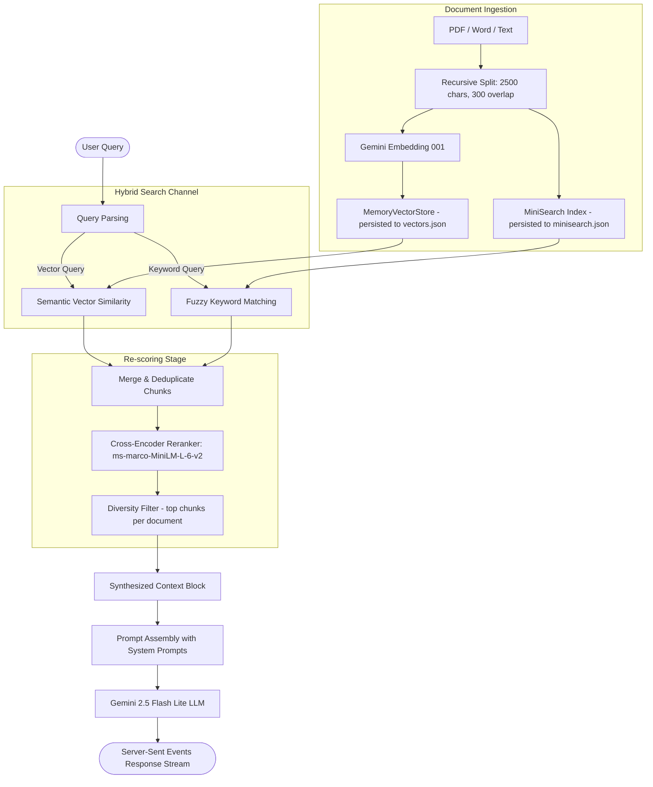

# RDA: RAG & Semantic Search Implementation Details

This document explains the concepts, algorithms, and architectural pipeline of the **Retrieval-Augmented Generation (RAG)** and **Semantic Search** engine implemented in the RAG Document Assistant (RDA).

---

## 💡 What is RAG and Why We Use It

**Retrieval-Augmented Generation (RAG)** is an AI framework that optimizes LLM outputs by querying authoritative external knowledge bases before generating responses.

### The Problem with Standalone LLMs
1. **Hallucinations**: LLMs generate responses based on probabilistic next-token predictions, meaning they can confidently state false facts.
2. **Outdated Knowledge**: LLMs are frozen in time at their training cut-off date.
3. **No Private Context**: Standard LLMs have no access to private, proprietary, or custom documents (e.g., your project report or company datasets).

### How RAG Solves This
Instead of sending a user's question directly to the LLM, the RAG architecture:
1. **Searches** uploaded documents for chunks matching the question.
2. **Retrieves** the most relevant text fragments.
3. **Appends** these text fragments to the user's prompt as trusted context.
4. **Instructs** the LLM to write an answer based *only* on the provided context.

This grounds the LLM in real data, reducing hallucinations and allowing the model to cite the exact source document and page number.

---

## 🛠️ The RDA Retrieval Pipeline

Our project implements a advanced **Hybrid Retrieval-Reranking Pipeline** to ensure high-accuracy search results. The flow is as follows:



---

## 🔍 In-Depth Pipeline Stage Explanations

### 1. Document Ingestion, Chunking, and Overlap
* **Loader**: PDFs are parsed using `PDFLoader` (extracting text page-by-page). Word and slides are parsed using `mammoth` and `officeparser` respectively.
* **Chunker**: Text is split using LangChain's `RecursiveCharacterTextSplitter`.
  * **Chunk Size**: **`2500` characters** (approx. 400-500 words). Larger chunks maintain sentence continuity and logical arguments.
  * **Chunk Overlap**: **`300` characters**. This overlap ensures that facts split across chunk boundaries are not lost, providing contextual anchors for search queries.

### 2. Embeddings Model (`gemini-embedding-001`)
* Text chunks are converted into mathematical representations using the cloud-hosted **`gemini-embedding-001`** model.
* It outputs a **768-dimensional vector** of floating-point numbers.
* Vectors represent the semantic meaning of the text. Words with similar semantic meanings (e.g. *"doctor"* and *"physician"*) are placed close together in the vector space.

### 3. Vector Storage & MiniSearch Indexing
* **Vector Storage**: Chunks are loaded into a LangChain `MemoryVectorStore`. On file ingest, the memory vectors are stringified and written to `uploads/indices/<userId>/vectors.json`. During boot, the system re-loads this file into memory.
* **MiniSearch Indexing**: Chunks are also loaded into a local full-text search instance (`MiniSearch` library) with configuration:
  ```javascript
  searchOptions: { boost: { text: 1 }, fuzzy: 0.2 }
  ```
  This is saved to `uploads/indices/<userId>/minisearch.json`. It provides fuzzy keyword search, matching specific jargon, serial numbers, or misspelled terms.

### 4. Hybrid Retrieval
* Our retriever queries *both* channels concurrently:
  * **Semantic Channel**: Similarity search calculates the distance between the query vector and the stored chunk vectors.
  * **Keyword Channel**: MiniSearch finds literal matching words, accounting for slight typos.
* **Merging**: The system maps both result arrays into a hash table. If a chunk is found by *both* channels, its score is boosted:
  ```javascript
  existing.score += doc.score; // Combined vector + keyword score boost
  ```
  This guarantees that documents with the correct semantic topics AND exact technical terms bubble to the top.

### 5. Local Cross-Encoder Reranking
* Standard vector search computes similarities of query and document separately. A **Cross-Encoder** feeds *both* query and document together into a transformer network to calculate a deep alignment score.
* **Model**: **`Xenova/ms-marco-MiniLM-L-6-v2`** run locally on the CPU inside Node.js.
* It evaluates all merged candidate chunks against the user's question, scoring them from `0` to `1`.
* Chunks are then sorted in descending order of their rerank scores, keeping only the top **`K`** chunks (user customizable, defaults to 6).

### 6. Diversity Slicing for Global/Summary Queries
* If the user query asks for summaries or comparisons (detected via regex `/summariz|summary|key points|overview|compare.../i`), retrieving standard top K chunks might result in all chunks coming from a single document.
* **Diversity Filter**: The system groups candidates by their source document. It dynamically slices a set of top chunks *per document*:
  ```javascript
  const chunksPerDoc = Math.max(2, Math.floor(12 / activeFileNames.length));
  ```
  This guarantees that summaries and comparisons represent *all* selected documents equally.

### 7. Prompt Assembly & Text Generation (`gemini-2.5-flash-lite`)
* The selected chunks are grouped by source filename and formatted into a context block:
  ```markdown
  === From document: project_report.pdf ===
  [Page 5 Content]
  [Page 12 Content]
  ```
* This block, along with the chat history, is injected into the system prompt.
* The synthesized prompt is sent to `gemini-2.5-flash-lite` (temperature: 0.7 by default, or overridden by Agent Studio personas) via standard or streaming HTTP requests.
