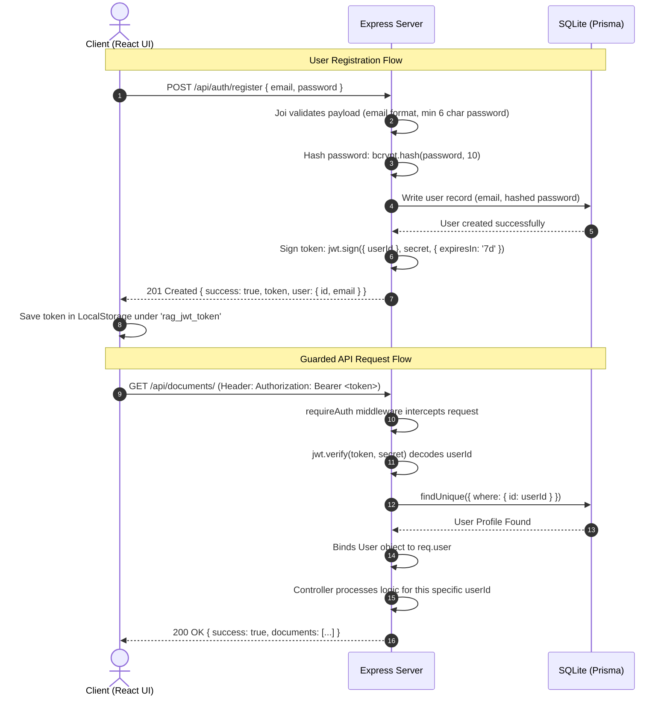

# RDA: Technical Stack & Architecture Explanation

This document explains the complete technical stack of the **RAG Document Assistant (RDA)** final year project, justifies the choice of frameworks, and details how core mechanisms like authentication and servers are managed in a local environment.

---

## 🛠️ Complete Technology Stack

The RDA project uses a decoupled, full-stack JavaScript architecture:

### 1. Frontend Client
* **Framework**: React 19 (via Vite build system).
* **Language**: TypeScript (for static type safety).
* **Styling**: Tailwind CSS (utility-first styling framework).
* **Component Primitives**: Radix UI (for accessible UI primitives like Collapsible and Scroll Area).
* **Icons**: Lucide React.
* **HTTP Client**: Axios (with custom request/response interceptors).
* **Charting / Visualization**: Recharts (fully responsive charting library).
* **Rich Content Rendering**: React Markdown (to render styled, cited RAG responses).

### 2. Backend API Server
* **Runtime**: Node.js (version 18+).
* **Framework**: Express (with JSON/URL-encoded body parsers, CORS handling, and compression).
* **Security & Optimization**: 
  * `helmet`: Sets HTTP security headers to prevent common web attacks.
  * `express-rate-limit`: Prevents DDoS and API brute-forcing.
  * `compression`: Implements Gzip compression for smaller network payloads.
* **OR/M**: Prisma ORM (Prisma Client JS).
* **Database**: SQLite (local serverless transactional relational database).
* **Validation**: Joi (schema validation for incoming HTTP request body payloads).

### 3. Artificial Intelligence & NLP Libraries
* **LLM Engine**: Google Generative AI SDK (accessing `gemini-2.5-flash-lite` for text synthesis).
* **Embeddings Model**: Google GenAI Embeddings client (using `gemini-embedding-001` to generate 768-dimensional vector embeddings).
* **Local Search**: MiniSearch (lightweight local full-text keyword indexing library).
* **Local NLP Processing**: Hugging Face Transformers (`@huggingface/transformers` using the `Xenova/ms-marco-MiniLM-L-6-v2` Cross-Encoder reranker).
* **File Parsers**: 
  * `pdf-parse` & `@langchain/community`: Extract text from PDFs.
  * `mammoth`: Extract text from Word documents (`.docx`).
  * `officeparser`: Extract text from PowerPoint files (`.pptx`).
  * `csv-parse/sync` & `xlsx` (SheetJS): Parse tabular data from CSV and Excel sheets.
  * `adm-zip`: Unpack bulk uploaded ZIP archives.

---

## 🧠 Why We Chose This Technical Stack

### Vite + React + TypeScript vs. Next.js
* **Why React**: React is the industry standard for single-page application (SPA) state orchestration. In our RAG system, managing complex page states (active chat sessions, selected document arrays, PDF viewer slide-outs) requires React's reactive virtual DOM.
* **Why Vite**: Unlike standard Create React App (Webpack), Vite leverages native ES Modules to compile changes in milliseconds, yielding a super-fast developer loop.
* **Why Not Next.js**: While Next.js is powerful, it is optimized for Server-Side Rendering (SSR) and deployment to edge environments. For a local desktop assistant, a client-side SPA (compiled to static HTML/JS/CSS assets) is much simpler, lighter, and easier to bundle.

### Node.js (Express) vs. Python (FastAPI/Flask)
* **Why Node.js**: Running both the frontend and backend in JavaScript allows sharing interfaces and structures. Node.js is also highly asynchronous, making it ideal for streaming Server-Sent Events (SSE) chat responses to the UI.
* **Why Express**: Express is minimal and unopinionated. It gives us complete control over middlewares, file-saving layouts, and V8 virtual machine context runs.

### SQLite + Prisma vs. PostgreSQL / MongoDB
* **Why SQLite**: SQLite is a serverless, single-file database. The examiner or user doesn't need to install or configure any database server (like Docker PostgreSQL instance) to run our app locally.
* **Why Prisma**: Prisma provides strong typescript types, autocompleted queries, and automates database migrations. It abstracts the SQL syntax, allowing us to swap SQLite to PostgreSQL with a single schema configuration change.

### Hybrid Local-Cloud AI Architecture
* **Gemini Cloud (LLM & Embeddings)**: Running embeddings and generation on Google's APIs gives us high performance and state-of-the-art results without needing a dedicated GPU.
* **Local Reranking (Cross-Encoder)**: Loading the Cross-Encoder (`ms-marco-MiniLM-L-6-v2`) locally in Node.js allows us to perform intensive semantic rank operations for free, saving API costs and maintaining data privacy.

---

## 🏃 NPM vs. NPX & Database Visualizer (Prisma Studio)

### 1. NPM (Node Package Manager)
* **What it is**: The default package registry and manager for the Node.js runtime environment.
* **Role as Dependency Manager**: It resolves and installs package structures listed in `package.json` into the local `node_modules/` folder.
* **Role as Task Runner**: It abstracts terminal executions into simple commands. In `package.json`, we configure scripts like:
  * `"dev": "nodemon src/app.js"` (launches the backend using Nodemon, which monitors changes and restarts the server automatically).
  * `"dev": "vite"` (spins up the Vite development build server).
* By using `npm run dev`, developers avoid typing complex configurations or setting up custom build flags manually.

### 2. NPX (Node Package Execute)
* **What it is**: A command-line package executor tool that comes bundled with NPM (since version 5.2.0).
* **The Execution Problem**: Local package binaries (like the Prisma CLI tool) are stored inside the project folder at `node_modules/.bin/`. Executing them directly would require typing a long path: `./node_modules/.bin/prisma studio`.
* **The NPX Solution**: NPX executes local binaries directly from your project's `node_modules/` folder without needing the full path. Typing `npx prisma studio` automatically routes to `./node_modules/.bin/prisma`. If a package is not installed locally, NPX will download it to a temporary cache, execute it, and discard it—keeping your computer clean of global CLI installations and preventing version conflicts.

### 3. Prisma Studio
* **What it is**: A built-in, lightweight web Graphical User Interface (GUI) database visualizer created by Prisma.
* **How to run it**: Run `npx prisma studio` in the `backend/` directory.
* **Why we use it**: It spins up a local web server (usually at `http://localhost:5555`) that provides a spreadsheet-like GUI. Instead of downloading heavy database client managers (like DB Browser for SQLite) or writing SQL queries in a terminal, developers and examiners can:
  * Inspect the SQLite database structure visually.
  * Search, filter, and paginate records in the `User`, `Document`, `ChatSession`, `ChatMessage`, and `Agent` tables.
  * Verify authentication details (such as Bcrypt hashed passwords).
  * Create, edit, or delete records during testing.

---

## 🔌 Network Port Allocations & Logic

During development, the application runs three separate web services on your local host, each bound to a specific **port number**. Port numbers act like apartment numbers in a building (your computer), routing incoming network traffic to the correct software process:

### 1. Port `5173` (Frontend UI - Vite)
* **Logic**: This is the default port assigned by the Vite build tool. 
* **Trivia**: Vite developers selected `5173` because it spells **"VITE"** using numeric keypad representations (5 = V, 1 = I, 7 = T, 3 = E). It is a custom development port, keeping it far away from standard ports to avoid conflicts.

### 2. Port `5000` (Backend API - Express)
* **Logic**: Port `5000` is a standard, widely accepted convention in web engineering for hosting development backend RESTful APIs and Node.js microservices. It resides in the **Registered Ports range** (1024 to 49151), meaning it does not collide with restricted operating system core services (such as SSH on port 22 or HTTP on port 80).

### 3. Port `5555` (Database GUI - Prisma Studio)
* **Logic**: Prisma Studio is hardcoded to boot on port `5555` by default in the Prisma engine. It is chosen to be distant from standard app development ports (3000, 5000, 8080), preventing port collisions if other local servers are running.

---

## 🔐 Authentication & Local Environment Encryption

The system implements a standard **JWT-based stateless authentication flow** to secure user workspaces.



### Password Encryption Details
* **Library**: `bcrypt` (native C++ bindings wrapper).
* **Algorithm**: **Blowfish cipher** based hashing.
* **Salt Rounds**: **`10`**. Adding a salt prevents **rainbow table attacks** (where attackers look up precomputed hashes). Using 10 rounds creates a computational delay of ~100ms, making brute-force dictionary attacks extremely slow, while remaining unnoticeable to legitimate users registering or logging in.
* **Verification**: In login, `bcrypt.compare(plaintextPassword, hashedDbPassword)` re-hashes the input password with the stored salt to verify matches.

### Token Authentication Details
* **Payload**: `{ userId: "user-uuid-string" }`.
* **Signing**: Signed using `jsonwebtoken` library and a configuration key (`JWT_SECRET`).
* **Expiration**: **7 days** (`7d`).
* **Client-side Storage**: React stores this token in `localStorage`.
* **Axios Interceptors**: A custom interceptor in `api/index.ts` automatically attaches the token to the HTTP request header:
  ```typescript
  config.headers.Authorization = `Bearer ${token}`;
  ```
* **Auto-Logout**: If the token expires or becomes invalid, the backend returns a `401 Unauthorized` status. The frontend's response interceptor intercepts the error, deletes the token from `localStorage`, and triggers a page reload, redirecting the user back to the Login panel.
