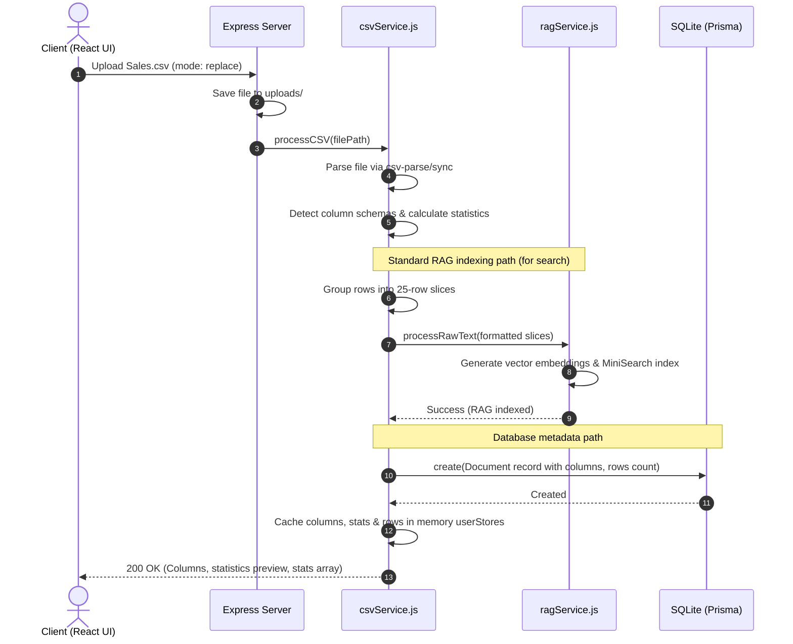
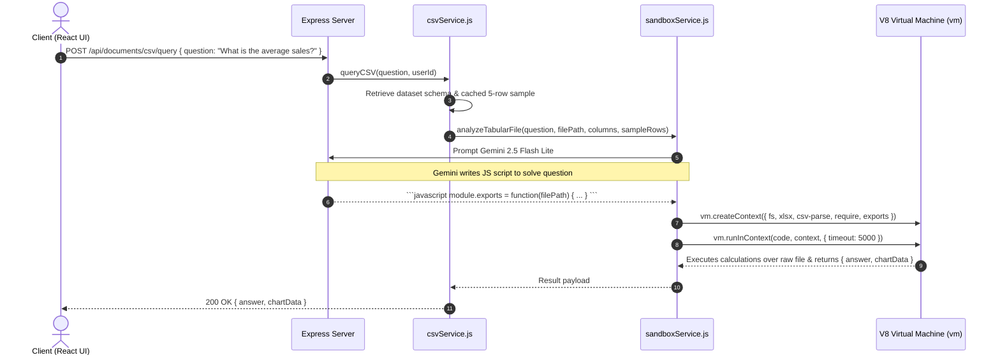

# RDA: System Workflows & Case Scenarios

This document outlines the detailed step-by-step workflows of the **RAG Document Assistant (RDA)** under different file conditions, queries, and system contexts.

---

## 📂 Ingestion Workflows

### Case 1: Uploading Unstructured Documents (`.pdf`, `.docx`, `.pptx`)
This path is optimized for semantic indexing and text retrieval.

1. **User Action**: Drops file in the Knowledge Base dashboard.
2. **Frontend Routing**: React uploads the file multipart data to `/api/documents/upload` with mode (`replace` or `append`).
3. **Backend Middleware**: Express saves the file under `backend/uploads/` via Multer.
4. **Service Mapping**:
   * If `.pdf`: Calls `ragService.processDocument(filePath)`.
   * If `.docx` or `.pptx`: Extracts plain text using `docxService` (via Mammoth) or `pptxService` (via OfficeParser) and forwards text to `ragService.processRawText()`.
5. **RAG Extraction & Splitting**:
   * Text is parsed and split into chunks of `2500` characters (overlap: `300`).
   * Metadata (original filename, upload date, character count, page number) is bound to each chunk.
6. **Vectorization**:
   * Chunks are sent to the `gemini-embedding-001` API in batches of 5 with a 1-second delay (to prevent free tier rate limits).
   * Resulting 768-dimension vectors are saved in the in-memory array.
7. **Local Search Indexing**:
   * The text is indexed in the client-side `MiniSearch` library.
8. **Persistence**:
   * In-memory vectors are written to `uploads/indices/<userId>/vectors.json`.
   * Keyword search indices are written to `uploads/indices/<userId>/minisearch.json`.
9. **Database Log**:
   * Prisma creates a new `Document` entry in the SQLite `dev.db` database.
10. **Client Notification**: Returns the chunk count, total documents, and an upload success Toast.

---

### Case 2: Uploading Tabular Spreadsheets (`.csv`, `.xlsx`)
This path is optimized for structured query sandboxing and database analysis.

1. **User Action**: Drops a spreadsheet file.
2. **Service Mapping**: Calls `csvService.processCSV()` or `excelService.processExcel()`.
3. **Structured Parsing**:
   * The spreadsheet is parsed (CSV via `csv-parse`, Excel worksheets via `xlsx`).
   * Column types are analyzed (`number`, `string`, `date`, `boolean`) by checking values.
   * Basic column statistics (Min, Max, Mean, Sum, Count of Missing rows, Unique count) are computed.
4. **Structured RAG Export**:
   * Rows are grouped into slices of 25.
   * Each slice is formatted as a text block (e.g. `[Row 1] ColumnA: Val1, ColumnB: Val2`).
   * Slices are saved as raw text chunks in the `ragService` to allow semantic searching of row records.
5. **Caching**:
   * In-memory cache `userStores` maps `userId_documentId` to the parsed arrays to avoid parsing large files on every query.
6. **Client Notification**: Returns the table schema, statistics, and a 10-row preview.

---

## 💬 Query & Reasoning Workflows

### Case 3: Querying Standard Documents (Text/PDF)
Optimized for semantic search and context synthesis.

1. **User Action**: Enters a chat message.
2. **API Request**: Posts to `/api/chat/query` with question, chat history, selected document IDs, and active custom Agent ID.
3. **Retrieval Scoping**:
   * `ragService` checks if the query is scoped to specific documents. If so, it loads only their indices.
   * Regex tests if the query is global (summaries/comparisons) or local.
4. **Hybrid Search Execution**:
   * **Semantic Search**: Searches vectors using `gemini-embedding-001` (returning distance scores).
   * **Keyword Search**: Searches the local `MiniSearch` index (returning matching metrics).
   * Combined candidates are merged and scores are added if found in both.
5. **Reranking**:
   * Merged chunks are sent to the local `ms-marco-MiniLM-L-6-v2` cross-encoder to compute relevance scores.
6. **Dynamic Slicing**:
   * If global: Diversity filter takes the top chunks from each document.
   * If local: Takes the top K absolute chunks.
7. **Prompt Synthesis**:
   * Relevant chunks are compiled, prepended with the active Agent system prompt and chat history, and formatted into the prompt template.
8. **Generation**:
   * Prompt is sent to `gemini-2.5-flash-lite`.
   * If streaming mode: Streams tokens using Server-Sent Events (SSE) `data: {"type": "content", "text": "..."}`.
   * Else: Returns the full JSON response.
9. **Citation Binding**: Chunks are bound to the message metadata so the frontend can display source citations with page numbers.

---

### Case 4: Querying Tabular Spreadsheets (Data Analysis)
Optimized for calculation accuracy using sandboxed script executions.

1. **User Action**: Asks a question on the **Sandbox** page (e.g. *"Plot total transactions grouped by city"*).
2. **API Routing**: Hits `/api/documents/csv/query` or `/api/documents/excel/query`.
3. **Retrieval**: `csvService` loads column schema, database path, and 5 sample rows.
4. **Sandbox Initiation**: Calls `sandboxService.analyzeTabularFile()`.
5. **Code Generation Prompt**:
   * Sends the table structure, column types, sample rows, and user question to `gemini-2.5-flash-lite` (temperature: 0.1).
   * Instructs the LLM to write a JavaScript module using `fs`, `csv-parse`, or `xlsx` that parses the file programmatically and computes the answer.
6. **Virtual Machine Run**:
   * Creates a V8 runtime sandbox context (`vm.createContext`).
   * Restricts imports to parsing libraries (`fs`, `path`, `csv-parse`, `xlsx`).
   * Runs the code with a **5-second timeout** (preventing infinite loops or freezing).
7. **Extraction**:
   * The script returns an object: `{ answer: "Markdown answer", chartData: { type, labels, datasets } }`.
8. **Client Rendering**:
   * Frontend displays the Markdown text and renders the chart using responsive Recharts graphs.

---

### Case 5: Custom Agent Persona Ingestion
Optimized for custom assistant behaviors.

1. **User Action**: Fills out the Agent Studio form, defining a name, system prompt, and temperature.
2. **Database Logging**: React calls `createAgent` API. Prisma inserts a record in the `Agent` table in SQLite.
3. **Selection**: User selects the newly created agent in the UI.
4. **Query Integration**:
   * When sending chat messages, the frontend appends the selected agent's UUID as `agentId` to the payload.
   * `ragService._prepareContextAndPrompt()` checks for `agentId`.
   * If present, it loads the agent's system prompt and temperature from the database.
   * Inserts the custom system instructions at the top of the LLM prompt.
5. **LLM Invocation**: Calls `gemini-2.5-flash-lite` using the custom temperature, modifying response creativity or structure.
